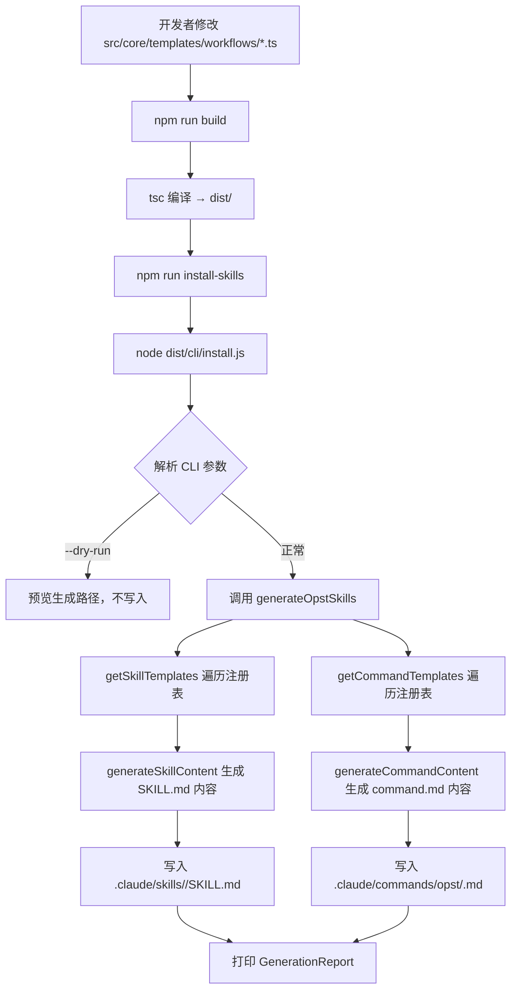
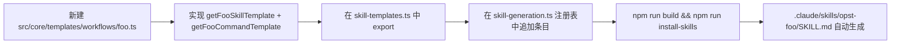

# Skill 扩展实现 — v1（2026-06-24）

## 1. 接口定义

| 字段 | 值 |
|------|----|
| CLI 入口 | `node dist/cli/install.js [--workspace <path>] [--dry-run]` |
| npm 脚本 | `npm run build` / `npm run install-skills` |
| 核心函数 | `generateOpstSkills(workspaceRoot)` |
| 入参 | `workspaceRoot: string`（默认 `process.cwd()`） |
| 出参 | `GenerationReport { skills: GeneratedFileResult[], commands: GeneratedFileResult[] }` |

**CLI 选项**：

```
--workspace, -w <path>   指定工作区根目录（默认：当前目录）
--dry-run                仅预览将要生成的文件，不实际写入
--version, -v            显示版本号
--help, -h               显示帮助
```

**GenerationReport 结构**：

```json
{
  "skills": [
    { "path": ".claude/skills/opst-code-anysic/SKILL.md", "status": "created" },
    { "path": ".claude/skills/opst-business-search/SKILL.md", "status": "created" }
  ],
  "commands": [
    { "path": ".claude/commands/opst/code-anysic.md", "status": "created" },
    { "path": ".claude/commands/opst/business-search.md", "status": "created" }
  ]
}
```

---

## 2. 业务流程图



**注册新 Skill 的流程**：



---

## 3. 业务逻辑详情

### 3.1 架构对齐（与 OpenSpec 源码的映射关系）

| OpenSpec 源码 | OpenSpecTrace 对应 |
|---------------|-------------------|
| `src/core/templates/workflows/*.ts` | `src/core/templates/workflows/*.ts` |
| `src/core/templates/skill-templates.ts` | `src/core/templates/skill-templates.ts` |
| `src/core/shared/skill-generation.ts` | `src/core/skill-generation.ts` |
| `src/core/workspace/skills.ts`（`generateWorkspaceAgentSkills`） | `src/core/skill-generation.ts`（`generateOpstSkills`） |
| `src/core/command-generation/adapters/claude.ts` | `generateCommandContent()` 内联实现 |
| `bin/openspec.js` + Commander.js | `src/cli/install.ts`（轻量 CLI，无 Commander 依赖） |

### 3.2 核心数据类型

**`SkillTemplate`**（`src/core/templates/types.ts`）：

```typescript
interface SkillTemplate {
  name: string;          // SKILL.md frontmatter name
  description: string;   // SKILL.md frontmatter description
  instructions: string;  // SKILL.md 正文（工作流步骤）
  license?: string;
  compatibility?: string;
  metadata?: Record<string, string>;  // author, version
}
```

**`CommandTemplate`**（`src/core/templates/types.ts`）：

```typescript
interface CommandTemplate {
  name: string;       // command.md frontmatter name
  description: string;
  category: string;
  tags: string[];
  content: string;    // command.md 正文（用户调用时 AI 读取的指令）
}
```

### 3.3 SKILL.md 生成逻辑（`generateSkillContent`）

```typescript
// src/core/skill-generation.ts
export function generateSkillContent(template: SkillTemplate): string {
  return `---
name: ${template.name}
description: >
  ${template.description}
license: ${template.license ?? 'MIT'}
compatibility: ${template.compatibility ?? 'Requires openspec CLI.'}
metadata:
  author: ${template.metadata?.author ?? 'fangkun'}
  version: "${template.metadata?.version ?? '1.0'}"
  generatedBy: "openspec-trace@${OPST_VERSION}"
---

${template.instructions}
`;
}
```

关键点：
- `description` 使用 YAML block scalar（`>`），避免中文冒号等特殊字符导致解析错误
- `generatedBy` 字段嵌入版本号，便于后续 `openspec update` 类命令检测过期 skill

### 3.4 Command 文件生成逻辑（`generateCommandContent`）

```typescript
export function generateCommandContent(template: CommandTemplate): string {
  const tags = template.tags.map((t) => escapeYamlValue(t)).join(', ');
  return `---
name: ${escapeYamlValue(template.name)}
description: ${escapeYamlValue(template.description)}
category: ${escapeYamlValue(template.category)}
tags: [${tags}]
---

${template.content}
`;
}
```

YAML 转义规则（对齐 OpenSpec `claude.ts` adapter）：
- 包含 `:` `"` `#` `{` `}` 等特殊字符的值用双引号包裹
- 内部双引号转义为 `\"`，换行转义为 `\n`

### 3.5 注册表设计（扩展入口）

```typescript
// src/core/skill-generation.ts
export function getSkillTemplates(): SkillTemplateEntry[] {
  return [
    { template: getOpstCodeAnysicSkillTemplate(),       dirName: 'opst-code-anysic',     workflowId: 'code-anysic' },
    { template: getOpstBusinessSearchSkillTemplate(),   dirName: 'opst-business-search',  workflowId: 'business-search' },
    // 新增 workflow 在此追加一行
  ];
}
```

新增 workflow 的最小改动：
1. 新建 `src/core/templates/workflows/<name>.ts`
2. 在 `skill-templates.ts` 添加 export
3. 在 `getSkillTemplates()` 和 `getCommandTemplates()` 追加条目
4. `npm run build && npm run install-skills`

---

## 4. 文件依赖关系图

```mermaid
erDiagram
    SKILL_TEMPLATES_TS ||--o{ WORKFLOW_TS : "re-exports"
    WORKFLOW_TS {
        string getSkillTemplate
        string getCommandTemplate
    }
    SKILL_GENERATION_TS ||--|| SKILL_TEMPLATES_TS : "imports"
    SKILL_GENERATION_TS {
        fn getSkillTemplates
        fn getCommandTemplates
        fn generateSkillContent
        fn generateCommandContent
        fn generateOpstSkills
    }
    CLI_INSTALL_TS ||--|| SKILL_GENERATION_TS : "imports"
    CLI_INSTALL_TS {
        fn parseArgs
        fn dryRun
        fn main
    }
    SKILL_GENERATION_TS ||--o{ CLAUDE_SKILLS : "writes"
    SKILL_GENERATION_TS ||--o{ CLAUDE_COMMANDS : "writes"
    CLAUDE_SKILLS {
        path ".claude/skills/opst-code-anysic/SKILL.md"
        path ".claude/skills/opst-business-search/SKILL.md"
    }
    CLAUDE_COMMANDS {
        path ".claude/commands/opst/code-anysic.md"
        path ".claude/commands/opst/business-search.md"
    }
```

---

## 5. 源码文件清单

| 文件 | 类型 | 说明 |
|------|------|------|
| `src/core/templates/types.ts` | 类型定义 | `SkillTemplate`、`CommandTemplate` 接口 |
| `src/core/templates/workflows/code-anysic.ts` | Workflow 模板 | `/opst:code-anysic` skill + command 内容 |
| `src/core/templates/workflows/business-search.ts` | Workflow 模板 | `/opst:business-search` skill + command 内容 |
| `src/core/templates/skill-templates.ts` | 统一导出 | 所有 workflow 模板的 re-export facade |
| `src/core/skill-generation.ts` | 核心生成 | 注册表、内容生成函数、文件写入逻辑 |
| `src/cli/install.ts` | CLI 入口 | 命令行参数解析 + 调用生成逻辑 |
| `package.json` | 项目配置 | `npm run build` / `npm run install-skills` |
| `tsconfig.json` | TS 配置 | `NodeNext` 模块系统，输出到 `dist/` |
| `.claude/skills/opst-code-anysic/SKILL.md` | 生成产物 | 由 `install-skills` 生成，非手写 |
| `.claude/skills/opst-business-search/SKILL.md` | 生成产物 | 由 `install-skills` 生成，非手写 |
| `.claude/commands/opst/code-anysic.md` | 生成产物 | 由 `install-skills` 生成，非手写 |
| `.claude/commands/opst/business-search.md` | 生成产物 | 由 `install-skills` 生成，非手写 |
