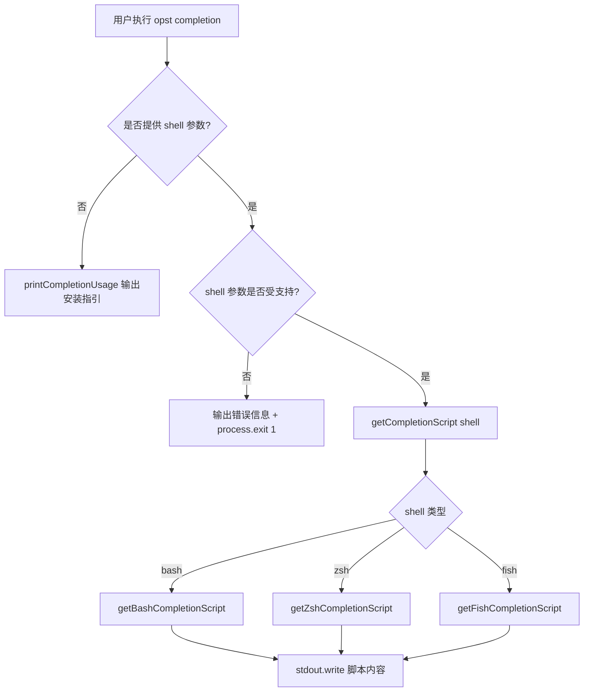
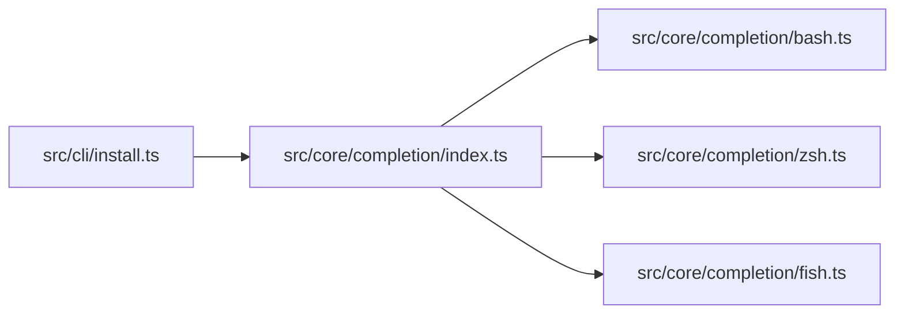

# Shell 补全 — v1（2026-06-24）

## 1. 接口定义

| 字段 | 值 |
|------|----|
| 命令 | `opst completion [bash\|zsh\|fish]` |
| 入口 | `src/cli/install.ts` → `main()` → completion 分支 |
| 入参 | shell 名称（可选，字符串：bash / zsh / fish） |
| 出参（有参数） | 对应 shell 的补全脚本（stdout 输出，纯文本） |
| 出参（无参数） | 使用说明文本（stdout 输出） |
| 出参（无效参数） | 错误信息 + exit code 1 |

## 2. 业务流程图



## 3. 业务逻辑详情

### 3.1 CLI 参数解析（src/cli/install.ts）

`parseArgs()` 在检测到第一个非 flag 参数为 `completion` 时：
- 设置 `opts.subcommand = 'completion'`
- 若后续还有非 flag 参数，存入 `opts.completionShell`

### 3.2 completion 分支逻辑（src/cli/install.ts:305-317）

```typescript
if (opts.subcommand === 'completion') {
  if (!opts.completionShell) → printCompletionUsage()
  if (!isSupportedShell(opts.completionShell)) → 错误 + exit(1)
  process.stdout.write(getCompletionScript(opts.completionShell))
}
```

### 3.3 统一分发接口（src/core/completion/index.ts）

- `SUPPORTED_SHELLS`: 只读元组 `['bash', 'zsh', 'fish']`
- `isSupportedShell(shell)`: 类型守卫，判断 shell 是否在支持列表中
- `getCompletionScript(shell)`: switch 分发到各 shell 模板函数

### 3.4 Bash 补全脚本（src/core/completion/bash.ts）

使用 `complete -F _opst_completions opst` 注册补全函数：
- 子命令补全：`install`、`init`、`completion`
- 选项补全（以 `-` 开头时）：`--workspace`、`--dry-run`、`--version`、`--help`
- 上下文补全：`completion` 后补全 shell 名称；`--workspace` 后补全目录

### 3.5 Zsh 补全脚本（src/core/completion/zsh.ts）

使用 `#compdef opst` + `_describe` 模式：
- CURRENT==2 时显示子命令 + 描述
- CURRENT==3 且前一个词为 `completion` 时显示 shell 选项

### 3.6 Fish 补全脚本（src/core/completion/fish.ts）

使用 Fish 内置 `complete -c opst` 命令：
- 全局禁用文件补全（`-f`）
- 按子命令条件（`__fish_use_subcommand` / `__fish_seen_subcommand_from`）注册补全项

## 4. 模块依赖图



## 5. 源码文件清单

| 文件 | 类型 | 说明 |
|------|------|------|
| `src/core/completion/index.ts` | 新增 | 统一导出接口，类型守卫，shell 分发 |
| `src/core/completion/bash.ts` | 新增 | Bash 补全脚本静态模板 |
| `src/core/completion/zsh.ts` | 新增 | Zsh 补全脚本静态模板 |
| `src/core/completion/fish.ts` | 新增 | Fish 补全脚本静态模板 |
| `src/cli/install.ts` | 修改 | 新增 completion 子命令分支 + printCompletionUsage |
